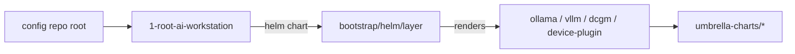

# AI Workstation Platform

GitOps-managed AI layer for the Forterro AI workstation: local LLM inference and routing on top of
the [k3s workstation platform](https://github.com/forterro/k3s-workstation-platform).

This repository is the public AI serving layer. It ships the workload charts (Ollama, vLLM, DCGM,
the NVIDIA device plugin) plus a small **layer chart** that renders them as ArgoCD Applications. A
per-workstation config repository composes this layer by deploying the layer chart with its own value
overlays; nothing here is user- or machine-specific.

## How it works

The base platform seeds k3s, cert-manager, step-ca, ArgoCD and MetalLB, then hands off to ArgoCD.
The private config repo's composition root deploys this repository's layer chart
(`bootstrap/helm/layer`), injecting its own repository URL so each app also reads a value overlay:



The layer chart is parameterized by a single `configRepoURL`. When it is empty the chart renders
standalone single-source Applications (public chart defaults only); when a config repo is provided,
apps flagged `overlay` gain a second source with the per-workstation `values/<app>.yaml`.

## Layers

| Group | Brick | Purpose |
| --- | --- | --- |
| `ai-platform` | `ollama` | Local inference engine (Ollama), dynamic multi-model swap |
| `ai-platform` | `vllm` | Local inference engine (vLLM), OpenAI-compatible endpoint |
| `gpu` | `dcgm-exporter` | NVIDIA GPU metrics for Prometheus |
| `gpu` | `nvidia-device-plugin` | Expose the NVIDIA GPU to the scheduler (GPU-PV on WSL2) |

Planned (next increments): `litellm` (tiered router), `qdrant`, `postgres` (KubeBlocks), `rag`.

## Conventions

This repository mirrors the base platform conventions:

- One thin umbrella chart per brick under `umbrella-charts/<group>/<brick>/`, wrapping a single
  pinned upstream chart, with glue (IngressRoute, Certificate) in `templates/`.
- The layer chart (`bootstrap/helm/layer`) renders one ArgoCD `Application` per brick, in the
  `ai-workstation` project. Apps flagged `overlay` are multi-source (public chart + config overlay).
- Services are exposed through Traefik over TLS, with certificates issued by step-ca via
  cert-manager (`*.workstation.internal`).

## Requirements

- A running base platform (k3s + ArgoCD + step-ca + Traefik + MetalLB).
- An NVIDIA GPU exposed to WSL2 via GPU-PV, with the NVIDIA container runtime configured in k3s.

## Compose it

This layer is composed by a per-workstation config repo, which deploys the layer chart with its own
`configRepoURL`. See the private config repository for the composition root (`1-root-ai-workstation`)
and the value overlays. To use the layer standalone (public defaults, no overlays), point an ArgoCD
Application at `bootstrap/helm/layer` with `configRepoURL` unset.

## Development

```bash
make deps      # helm dependency update for every umbrella chart
```

## License

Apache License 2.0. See [LICENSE](LICENSE).
