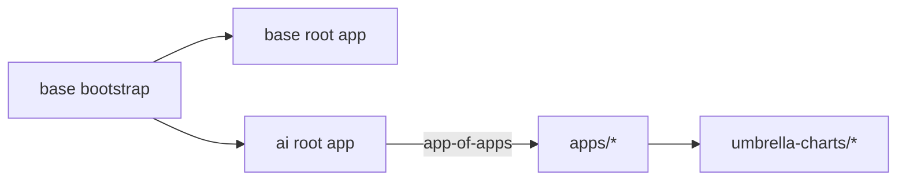

# AI Workstation Platform

GitOps-managed AI layer for the Forterro AI workstation: local LLM inference and routing on top of
the [k3s workstation platform](https://github.com/forterro/k3s-workstation-platform).

This repository is the public AI layer. It contributes its own ArgoCD app-of-apps, applied by the
base platform's bootstrap, so the AI stack reconciles independently from the base bricks.

## How it works

The base platform seeds k3s, cert-manager, step-ca, ArgoCD and MetalLB, then hands off to ArgoCD.
This repository plugs into that ArgoCD with its **own root app-of-apps**:



The base bootstrap applies this repository's root app because it is listed under `extra_root_apps`
in the consumer config (`~/.k3s-workstation-platform/config.yaml`). Nothing in the base repository
references the AI layer.

## Layers

| Group | Brick | Purpose |
| --- | --- | --- |
| `gpu` | `nvidia-device-plugin` | Expose the NVIDIA GPU to the scheduler (GPU-PV on WSL2) |
| `ai-platform` | `vllm` | Local inference engine (vLLM) serving an OpenAI-compatible endpoint |

Planned (next increments): `litellm` (tiered router), `qdrant`, `postgres` (KubeBlocks), `rag`.

## Conventions

This repository mirrors the base platform conventions:

- One thin umbrella chart per brick under `umbrella-charts/<group>/<brick>/`, wrapping a single
  pinned upstream chart, with glue (IngressRoute, Certificate) in `templates/`.
- One ArgoCD `Application` per brick under `apps/`, in the `ai-platform` project.
- Services are exposed through Traefik over TLS, with certificates issued by step-ca via
  cert-manager (`*.workstation.internal`).

## Requirements

- A running base platform (k3s + ArgoCD + step-ca + Traefik + MetalLB).
- An NVIDIA GPU exposed to WSL2 via GPU-PV, with the NVIDIA container runtime configured in k3s.

## Wire it into the bootstrap

Add this repository's root app to the base consumer config, then re-run the bootstrap:

```yaml
# ~/.k3s-workstation-platform/config.yaml
extra_root_apps:
  - name: ai-platform
    path: ../ai-workstation-platform/bootstrap/helm/root-app
```

```bash
uv run k3s-workstation-bootstrap bootstrap
```

## Development

```bash
make deps      # helm dependency update for every umbrella chart
```

## License

Apache License 2.0. See [LICENSE](LICENSE).
