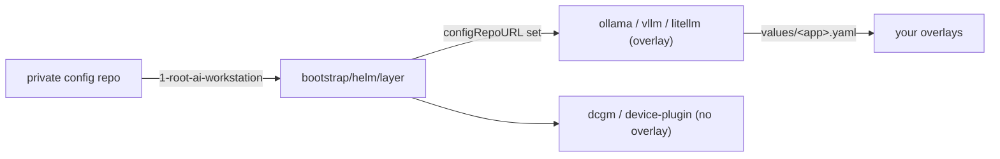

# Composing the AI layer from your private config repo

This repository is a public, user-agnostic AI serving layer. It is deployed by a **private**
per-workstation config repository that supplies the machine-specific bits: which components run, which
models are pulled, and any secrets. This document covers what to add to that private repo to compose
this layer.

If you do not have a private config repo yet, create one first. The full walk-through (repo layout,
age key, `.gitignore`, `.sops.yaml`, `config.yaml`, bootstrap wiring) lives in the base platform
repository `k3s-workstation-platform`, under `docs/private-config-repo.md`.

## 1. Declare the AI layer as a component

In your private repo's `config.yaml`, add the AI layer to `extra_root_apps`. Each entry points at a
public layer chart (`repo_url` + `path`) and its ArgoCD `project`:

```yaml
extra_root_apps:
  - name: 1-root-ai-workstation
    project: ai-workstation
    repo_url: https://github.com/<org>/ai-workstation-platform.git
    revision: main
    path: bootstrap/helm/layer
```

The bootstrap turns this into one ArgoCD Application pointing at `bootstrap/helm/layer`, injecting your
private repo's URL as the `configRepoURL` Helm parameter. The layer chart then renders one child
Application per brick.

## 2. How the layer consumes your overlays

The layer chart ([bootstrap/helm/layer](../bootstrap/helm/layer)) is the single source of truth for
the AI bricks. Each app can be `overlay: true`, meaning it reads a per-workstation overlay from your
config repo:

| App | Namespace | `overlay` | Config-repo overlay file |
| --- | --- | --- | --- |
| `ollama` | `ollama` | yes | `values/ollama.yaml` |
| `vllm` | `ai-platform` | yes | `values/vllm.yaml` |
| `litellm` | `litellm` | yes | `values/litellm.yaml` |
| `dcgm-exporter` | `dcgm-exporter` | no | (public defaults only) |
| `nvidia-device-plugin` | `nvidia-device-plugin` | no | (public defaults only) |

When `configRepoURL` is set, each `overlay: true` app becomes a multi-source Application: the public
chart at its pinned revision, plus your config repo as a `$values` reference that supplies
`values/<name>.yaml`. When `configRepoURL` is empty, every app renders standalone from public chart
defaults only.



## 3. Add the value overlays

Create these files under `values/` in your private repo. The filename must match the app `name`.

### `values/ollama.yaml`

Enable the Ollama engine and pin the models this machine should host:

```yaml
# Layered on top of the public ollama chart defaults.
ollama:
  enabled: true
  ollama:
    models:
      pull:
        - qwen2.5:7b-instruct
        - qwen2.5-coder:14b
```

### `values/vllm.yaml`

vLLM is an alternative engine. Keep it disabled while Ollama is active:

```yaml
# Layered on top of the public vllm chart defaults.
vllm-stack:
  enabled: false
```

### `values/litellm.yaml`

LiteLLM is the OpenAI-compatible router in front of the engines. The overlay pins this machine's
backend models and toggles the SaaS escalation tier:

```yaml
# Layered on top of the public litellm chart defaults.
router:
  opsModel: qwen2.5:7b-instruct
  codingModel: qwen2.5-coder:14b

saas:
  enabled: false
```

The public chart defaults (routing tiers, classifier type, keyword rules) are documented in
[umbrella-charts/ai-platform/litellm/values.yaml](../umbrella-charts/ai-platform/litellm/values.yaml).
The overlay only sets what is machine-specific.

## 4. Secrets for AI apps

Application secrets (for example a SaaS provider API key when `saas.enabled: true`) go under
`secrets/` in your private repo as SOPS-encrypted `*.enc.yaml`, per the repo's `.sops.yaml`. The KSOPS
plugin in the ArgoCD repo-server decrypts them at render time using the `sops-age` secret seeded by the
bootstrap. See the base platform doc for the encryption setup.

## See also

- Creating the private config repo (age key, `config.yaml`, bootstrap wiring): the
  `k3s-workstation-platform` repository, `docs/private-config-repo.md`.
- The layer chart and brick list: [bootstrap/helm/layer/values.yaml](../bootstrap/helm/layer/values.yaml).
- This layer's overview: the [README](../README.md).
